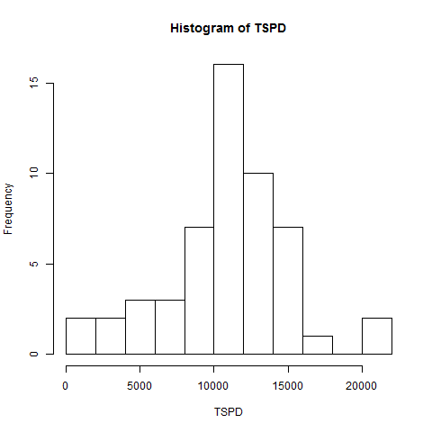
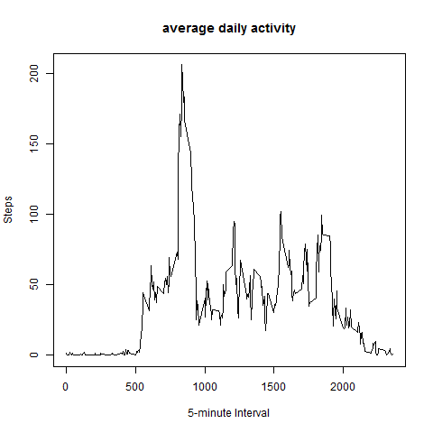
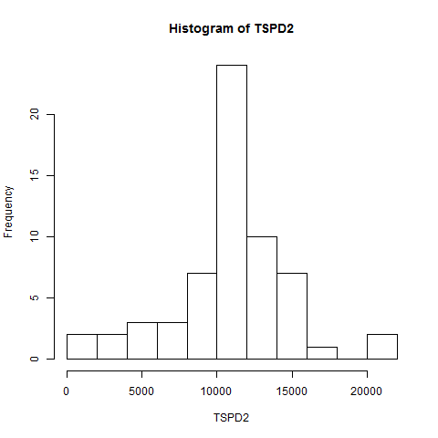
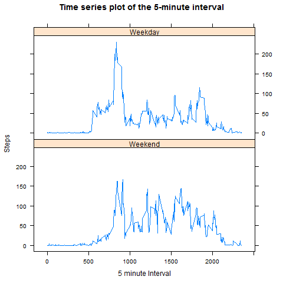

title: "PA1_template"
output: html_document
---

#1
```{r}
table1 <- read.csv("activity.csv",stringsAsFactors = F)
```

#2
```{r}
TSPD <- tapply(table1$steps, table1$date, FUN = sum)
hist(TSPD, breaks = 12)
```
<!-- -->

```r
MS <- mean(TSPD, na.rm = TRUE)
MS
```

```
## [1] 10766.19
```

```r
MedianS <- median(TSPD, na.rm = TRUE)
MedianS
```

```
## [1] 10765
```
#3
```{r}
ADCP <- tapply(table1$steps, table1$interval, FUN = mean, na.rm = TRUE)
plot(x=names(ADCP),y=ADCP, 
     type = "l", 
     xlab = "5-minute Interval", 
     ylab = "Steps", 
     main = "average daily activity")
```
<!-- -->
```{r}
names(which.max(ADCP))
```
```
## [1] 835
```

#4
```{r}
MissingValue <- which(is.na(table1$steps)==T)
length(MissingValue)
```

```
## [1] 2304
```
```r
table2 <- table1
for (i in MissingValue){
  table2$steps[i] <- ADCP[which(names(ADCP)==table2$interval[i])]
}

TSPD2 <- tapply(table2$steps, table2$date, FUN = sum)
hist(TSPD2, breaks = 12)
```

```r
mean(TSPD2)
```
<!-- -->
```
## [1] 10766.19
```
```r
median(TSPD2)
```
```
## [1] 10766.19
```

#5
```{r}
library(lattice)
library(lubridate)
table2week <- table2
table2week$week <- weekdays(ymd(table2$date))


for(i in 1:length(table2week$week)){
  if (table2week$week[i] %in% c("Saturday","Sunday")){
    table2week$week[i] <- "Weekend"
  }
  else {
    table2week$week[i] <- "Weekday"
  }
}


StepInW <- aggregate(table2week$steps, 
          by = list(table2week$interval, table2week$week), 
          FUN = mean)

names(StepInW) <- c("interval", "day", "steps")


xyplot(steps ~ interval|day, data = StepInW, type = "l", layout = c(1,2), 
       xlab = "5 minute Interval", 
       ylab = "Steps", 
       main = "Time series plot of the 5-minute interval", 
       index.cond = list(2:1))
```
<!-- -->
